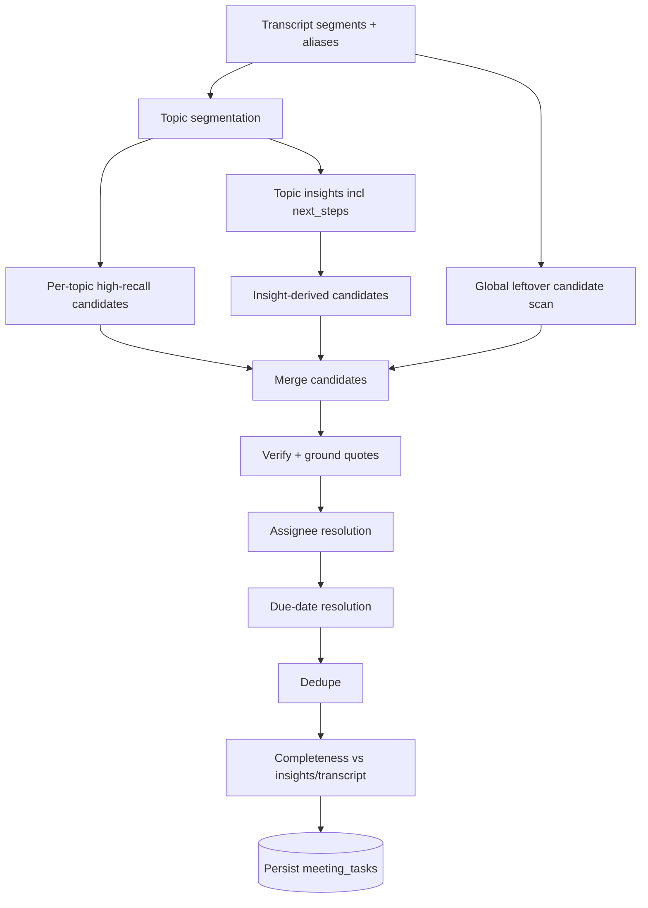

# TASK_EXTRACTION_AUDIT.md

**Repository:** Parfait / ActionFlow  
**Audit date:** 2026-07-22  
**Scope:** Read-only inspection of meeting → task extraction. No production code, prompts, or migrations were modified by this audit.  
**Primary extraction entry point:** `POST /api/meetings/[id]/analyze` → `extractTopicTasksWithOpenAI` in `lib/analysis.ts`

---

# 1. Executive Summary

## How Parfait currently extracts tasks

Confirmed pipeline:

1. Recall webhook / sync status imports a transcript into `transcript_segments` (`lib/recall/processing.ts` → `replaceMeetingTranscriptFromRecall`).
2. Processing then POSTs to `/api/meetings/[id]/analyze` (`analyzeImportedMeeting`).
3. Analyze loads segments + speaker aliases, builds a full transcript, and calls **topic segmentation** (`segmentMeetingTopicsWithOpenAI`).
4. After successful segmentation, it **deletes all existing `meeting_tasks` for the meeting**, then for each topic:
   - runs **insight/summary analysis** (`analyzeTranscriptWithOpenAI`) on that topic’s segments;
   - runs **task extraction** (`extractTopicTasksWithOpenAI`) on the same topic segments only;
   - inserts rows into `meeting_tasks`.
5. Optionally batch-categorizes inserted tasks (`categorizeMeetingTasksBestEffort`).
6. Meeting UI loads tasks from `meeting_tasks` and groups them by `topic_id` (`app/meetings/[id]/page.tsx`, `components/topic-results.tsx`, `components/execution-dashboard.tsx`).

There is **no second extraction path** that turns insight `next_steps` or topic summaries into tasks. Task creation is exclusively topic-scoped OpenAI structured output.

## Most important weaknesses (tied to code)

| Weakness | Evidence |
|----------|----------|
| **Whole-meeting fallback creates zero tasks** | `runWholeMeetingFallback` in `app/api/meetings/[id]/analyze/route.ts` saves insights only and returns `tasks: []`. |
| **Insights/summaries never become tasks** | `buildInsightsPayload` stores `next_steps` as `extracted_insights`; nothing maps those rows into `meeting_tasks`. |
| **Prompt is precision-biased** | `"If no clear action items exist, return an empty tasks array."` in `extractTopicTasksWithOpenAI`. |
| **Per-topic failures are swallowed** | Failed `analyzeTranscriptWithOpenAI` → `continue`; failed task extraction → `console.warn` only; empty `topicSegments` → skip. |
| **No extraction unit/integration tests** | Repo has task-chat/deliverable/speaker tests; **zero** tests call `extractTopicTasksWithOpenAI` or the analyze route. |
| **No due dates extracted** | DB has `due_date` (`20260714073000_add_task_due_date.sql`); extraction schema/prompt omit it. |
| **Reprocess wipes tasks before re-extract** | Successful segmentation path calls `deleteMeetingTasks(id)` before insert. |

## Most likely reasons tasks are missed

1. Topic segmentation fails or returns empty → fallback path → **insights without tasks**.
2. Topic `segment_ids` do not map to real segment UUIDs → topic skipped (`topicSegments.length === 0`).
3. Model returns empty `tasks` because prompt requires “clear” action items.
4. Action items appear only in insight `next_steps` / topic `summary`, not in the transcript slice sent to the task model.
5. Task extraction OpenAI/schema failure for a topic is logged and ignored; meeting still returns success with remaining tasks.
6. Insert dedupe / unique index `meeting_tasks_dedupe_idx` on `(meeting_id, topic_id, task_type, lower(task))` drops or fails near-duplicates.
7. Short meetings skipped entirely (`MIN_ANALYSIS_SEGMENTS = 2`, `MIN_ANALYSIS_WORDS = 25`).

## Highest-priority improvements

1. **P0:** Make whole-meeting fallback also extract tasks (or refuse to claim analysis “completed” with empty tasks when insights contain next steps).
2. **P0:** Add completeness pass: compare transcript + topic summaries + insight `next_steps` vs stored tasks; generate missing candidates.
3. **P1:** Rewrite task prompt/schema for high-recall grounded extraction (unknown assignee/due date allowed; multi-turn; questions-as-tasks; negations/corrections).
4. **P1:** Instrument per-topic extraction counts, validation failures, insert errors; stop swallowing insert failures.
5. **P1:** Build offline evaluation harness with synthetic transcripts (this report’s §10–11).

---

# 2. Current End-to-End Pipeline

## Numbered sequence

### 1. Recall webhook received
- **File:** `app/api/recall/webhook/route.ts`
- **Function:** `POST`
- **Inputs:** Raw body, `x-recall-signature` (verified fail-closed in production)
- **Outputs:** Meeting status update; on completion events → `processCompletionWithRetry`
- **Failure:** Invalid signature → 401; processing errors leave meeting in `processing`

### 2. Completion processing
- **File:** `lib/recall/processing.ts`
- **Function:** `processCompletedRecallMeeting`
- **Inputs:** `meetingId`, `recallBotId`, optional `requestOrigin`
- **Outputs:** Transcript replace + analysis status
- **Failure:** Throws; webhook catches and keeps `processing`

### 3. Transcript fetch + parse + store
- **File:** `lib/recall/processing.ts` → `replaceMeetingTranscriptFromRecall`; `lib/recall/transcript.ts` → `fetchRecallTranscript`, `parseRecallTranscriptToSegments`
- **Inputs:** Recall bot id
- **Outputs:** Deletes prior `transcript_segments`, inserts new rows (`speaker`, `participant_name`, `diarized_speaker`, `resolved_speaker`, `text`, `timestamp`, `raw_payload`)
- **Failure:** Empty parse → `ready: false` (analysis not started); insert errors throw

### 4. Speaker resolution at import
- **File:** `lib/speaker-aliases.ts` helpers used in `replaceMeetingTranscriptFromRecall`
- **Inputs:** Parsed rows + `meeting_speaker_aliases`
- **Outputs:** Resolved `speaker` labels on rows
- **Failure:** Alias load error throws

### 5. Trigger analyze
- **File:** `lib/recall/processing.ts`
- **Function:** `analyzeImportedMeeting`
- **Inputs:** Internal secret header `x-parfait-internal-secret`; base URL from `getAppBaseUrl`
- **Outputs:** HTTP to `POST /api/meetings/{id}/analyze`
- **Failure:** Non-OK response throws (webhook may leave meeting processing)

### Alternate entry: manual / sync
- **File:** `app/api/meetings/[id]/sync-status/route.ts` → same `processCompletedRecallMeeting`
- **File:** Authenticated client can also call analyze directly via `requireApiUser` path in analyze route

### 6. Analyze auth + load transcript
- **File:** `app/api/meetings/[id]/analyze/route.ts` → `POST`
- **Inputs:** Meeting id; user session **or** internal secret
- **Outputs:** `safeSegments` via `applySpeakerAliases`
- **Failure:** Missing meeting/transcript → 404/400; short transcript → `{ skipped: true, tasks: [] }`

### 7. Topic segmentation (model call #1 family)
- **File:** `lib/analysis.ts` → `segmentMeetingTopicsWithOpenAI`
- **Inputs:** Full transcript with `[segment.id]` prefixes (`buildTranscriptWithSegmentIds`)
- **Outputs:** Topics with `segment_ids`, summaries
- **Failure:** Empty/invalid → `runWholeMeetingFallback` (**no tasks**)

### 8. Wipe prior analysis artifacts
- **File:** analyze route → `deleteMeetingTasks`, delete insights, delete topics
- **Risk:** After this point, previous good tasks are gone even if later topic loops fail partially

### 9. Insert topics
- **File:** analyze route
- **Note:** `segment_ids` filtered to IDs present in `segmentMap` (invalid IDs dropped)

### 10. Per-topic insight analysis (model call)
- **File:** `lib/analysis.ts` → `analyzeTranscriptWithOpenAI`
- **Inputs:** Topic transcript only
- **Outputs:** Product summary, requirements, **next_steps**, etc. → `extracted_insights`
- **Failure:** `continue` → **no tasks for that topic either** (task extraction still runs only if analysis succeeded… actually looking at code: if `!topicAnalysis.ok` it `continue`s **before** task extraction — so **insight failure also skips task extraction**)

### 11. Per-topic task extraction (model call)
- **File:** `lib/analysis.ts` → `extractTopicTasksWithOpenAI`
- **Inputs:** Topic title/summary + topic segments
- **Outputs:** Structured tasks array
- **Failure:** Logged warn; topic contributes zero tasks

### 12. Persist tasks
- **File:** analyze route → `buildMeetingTasksPayload` → `insertMeetingTaskRows`
- **In-memory dedupe** on `meeting_id|topic_id|task_type|lower(task)`
- **DB unique index** same key (`meeting_tasks_dedupe_idx`)
- **Failure:** Missing table treated as success with empty data; other insert errors currently not rethrown to client as partial failure (only empty contribution)

### 13. Post-insert categorization (optional)
- **File:** `lib/task-categorization-batch.ts` → `categorizeMeetingTasksBestEffort`
- **Failure:** Caught; tasks remain

### 14. Frontend retrieval
- **File:** `app/meetings/[id]/page.tsx` selects `meeting_tasks`
- **UI:** `TopicResults` filters by `topic_id`; `ExecutionDashboard` shows all; `ActionItemsPanel` splits commitments vs unassigned (does not hide unassigned)

## Mermaid flowchart (current)

```mermaid
flowchart TD
  A[Recall webhook / sync-status] --> B[processCompletedRecallMeeting]
  B --> C[replaceMeetingTranscriptFromRecall]
  C --> D[(transcript_segments)]
  B --> E[POST /api/meetings/id/analyze]
  E --> F{Enough segments/words?}
  F -->|no| G[Return skipped tasks=[]]
  F -->|yes| H[segmentMeetingTopicsWithOpenAI]
  H -->|fail/empty| I[runWholeMeetingFallback]
  I --> J[analyzeTranscriptWithOpenAI full meeting]
  J --> K[(extracted_insights only)]
  K --> L[Return tasks=[]]
  H -->|ok| M[DELETE meeting_tasks + insights + topics]
  M --> N[INSERT meeting_topics]
  N --> O[For each topic]
  O --> P{segment_ids resolve?}
  P -->|no| Q[Skip topic]
  P -->|yes| R[analyzeTranscriptWithOpenAI topic]
  R -->|fail| Q
  R -->|ok| S[INSERT extracted_insights incl next_steps]
  S --> T[extractTopicTasksWithOpenAI]
  T -->|fail| U[warn continue]
  T -->|ok| V[insertMeetingTaskRows]
  V --> W[(meeting_tasks)]
  W --> X[categorizeMeetingTasksBestEffort]
  X --> Y[Meeting page / ExecutionDashboard]
```

---

# 3. Relevant File Inventory

| File path | Responsibility | Important functions | Inputs | Outputs | Potential extraction risk |
|-----------|----------------|---------------------|--------|---------|---------------------------|
| `app/api/recall/webhook/route.ts` | Webhook entry | `POST`, `processCompletionWithRetry` | Recall events | Status + processing | Analysis failures leave processing; no task visibility |
| `app/api/meetings/[id]/sync-status/route.ts` | Manual reprocess | `POST`/`GET` | Auth + meeting | Same as webhook completion | Re-triggers full wipe+analyze |
| `lib/recall/processing.ts` | Transcript + analyze trigger | `replaceMeetingTranscriptFromRecall`, `analyzeImportedMeeting`, `processCompletedRecallMeeting` | Bot id | Segments + analyze | Empty transcript → no analyze |
| `lib/recall/transcript.ts` | Fetch/parse Recall JSON | `fetchRecallTranscript`, `parseRecallTranscriptToSegments` | Recall API | Segment rows | Bad parse → zero segments |
| `lib/recall/client.ts` | Bot create/status | `createRecallBot`, `fetchRecallBotStatus` | Meeting URL | Bot id/status | Upstream of extraction only |
| `lib/speaker-aliases.ts` | Speaker mapping | `applySpeakerAliases`, `resolveTaskOwner`, etc. | Segments/aliases | Display names | Wrong owner labels |
| `lib/transcript-segments.ts` | Safe segment ID filtering | `filterValidSegmentIds`, loaders | Topic segment_ids | Valid UUIDs | Invalid IDs drop context (workspace); analyze filters similarly |
| `app/api/meetings/[id]/analyze/route.ts` | **Core orchestration** | `POST`, `runWholeMeetingFallback`, `insertMeetingTaskRows` | Meeting id | Topics/insights/tasks | **Fallback zero tasks; swallowed failures** |
| `lib/analysis.ts` | Prompts, schemas, OpenAI calls | `segmentMeetingTopicsWithOpenAI`, `analyzeTranscriptWithOpenAI`, `extractTopicTasksWithOpenAI`, `buildMeetingTasksPayload`, `buildInsightsPayload` | Transcript / topic | Structured JSON | Precision-biased task prompt; no due dates |
| `lib/openai.ts` | Client/model | `getOpenAIClient`, `getOpenAIModel` | Env | OpenAI client | Default model only; no temp/retry config |
| `lib/env.ts` | Env validation | `getServerEnv` | Process env | Model name etc. | Default `gpt-4.1-mini` |
| `lib/task-categorization.ts` | Post-hoc category | `categorizeTaskWithOpenAI`, batch | Existing tasks | Metadata | Does not create tasks |
| `lib/task-categorization-batch.ts` | Best-effort updates | `categorizeMeetingTasksBestEffort` | Inserted tasks | DB updates | Failures ignored |
| `lib/types.ts` | TS types | `MeetingTask`, enums | — | Types | `due_date` optional; not in extraction |
| `supabase/migrations/20260624053500_add_meeting_tasks.sql` | Task table | — | — | Schema + unique dedupe | Unique index can reject inserts |
| `supabase/migrations/20260630021500_add_task_workspace_fields.sql` | workspace_type | — | — | Check constraint | Extraction enum must match |
| `supabase/migrations/20260714073000_add_task_due_date.sql` | due_date column | — | — | Column | Never filled by extract |
| `supabase/migrations/20260714080000_add_smart_task_deliverables.sql` | Categories/metadata | — | — | Extended workspace_type | Extraction still uses legacy enum |
| `supabase/migrations/20260615211000_add_meeting_topics.sql` | Topics | — | — | `segment_ids` jsonb | Bad IDs → empty topic segments |
| `app/meetings/[id]/page.tsx` | Load tasks for UI | page query | Meeting id | Props | Missing column in select would hide fields |
| `components/topic-results.tsx` | Per-topic task display | filter by topic_id | tasks | ActionItemsPanel | Orphan topic_id → invisible in topics UI |
| `components/action-items-panel.tsx` | Action item cards | filter unassigned | tasks | UI | Does not hide; separates sections |
| `components/execution-dashboard.tsx` | Owner grouping | `updateTaskOwner` | All tasks | Dashboard | Shows unassigned bucket |
| `lib/ai/task-chat-agent.ts` | Post-extract chat edits | — | Task | Patches | Not extraction |
| `tests/*` | Mostly chat/deliverables/speakers | — | — | — | **No extraction quality tests** |

---

# 4. Exact Prompt Analysis

## 4.1 Topic segmentation — `segmentMeetingTopicsWithOpenAI`

**Location:** `lib/analysis.ts` (~lines 436–468)

**Asks the model to:** Split the meeting into 3–8 product topics; assign `segment_ids`; summarize; ignore small talk.

**Does well:** Forces structured topics; allows non-contiguous segments; grounds IDs in transcript prefix format.

**Missing / risks:**
- Does not prioritize action-item-bearing segments.
- Preferring 3–8 topics can over-fragment or under-cover.
- Invalid invented UUIDs are silently dropped later → empty topics → **no tasks**.
- No instruction to keep commitment-bearing lines from being orphaned.

**Precision vs recall:** Topic quality gate for all downstream task recall. Failure → fallback with **zero tasks**.

## 4.2 Insight / summarization — `analyzeTranscriptWithOpenAI`

**Location:** `lib/analysis.ts` (~lines 228–244)

**System:** “Convert meeting transcript content into concise structured implementation-ready outputs.”  
**User:** Analyze transcript → JSON schema including `next_steps`.

**Does well:** Captures next steps as insight strings.

**Critical gap:** `next_steps` are **never converted to `meeting_tasks`**. This is the exact failure mode “summary has action items but no tasks.”

**Also:** Used per-topic; if it fails, the analyze loop **skips task extraction for that topic** (`continue` before `extractTopicTasksWithOpenAI`).

## 4.3 Task extraction — `extractTopicTasksWithOpenAI`

**Location:** `lib/analysis.ts` (~lines 300–362)

Full prompt intent (paraphrased with key rules preserved):

- Extract from **exactly one topic**; only provided excerpt.
- Empty array if no **clear** action items.
- Types: `commitment`, `implicit_commitment`, `unassigned_work`.
- Owner from speaker label / named person / self-ID; else null.
- Normalize vague commitments; source_quote; 2–5 suggested steps; priority; workspace_type classification; workspace_summary.
- Ownership few-shot examples (Aditya/Sarah/John/Maya/Alex).

**Does well:** Explicit ownership heuristics; allows null owner; distinguishes unassigned work; asks for source quotes.

**Missing instructions (confirmed absent):**
- Interrogative assignments (“Can you follow up with Craig?”).
- Hortative group asks (“Let’s have Jay prepare…” partially covered by naming rule, not explicitly).
- Multi-turn clarification / pronoun resolution across turns.
- Negations (“don’t send”).
- Corrections (“not Pogue, Poke”).
- Already-completed work.
- Conditional tasks.
- Recurring tasks.
- Due dates / relative dates.
- Multiple tasks in one sentence (split rule).
- Dedup when same task restated.
- Decisions vs tasks.
- Grounding via segment IDs (only free-text quote).
- Completeness check against topic summary.

**Precision vs recall:** Explicitly encourages **empty output when unclear** → lowers recall.

**Implicit tasks:** Partially via `implicit_commitment` and `unassigned_work`, but “clear action items” undermines this.

**Multi-turn:** Not instructed.

**Assignees / deadlines:** Assignees optional (good); deadlines not in schema (cannot extract).

**Merge risk:** No “do not merge distinct commitments” rule.

**Hallucination:** “Do not invent” present (good).

**Transcript format:** Timestamp + speaker lines; no segment IDs in task-extraction transcript (only clean transcript) → weaker grounding than segmentation pass.

## 4.4 Task categorization — `lib/task-categorization.ts` `SYSTEM_PROMPT`

Post-persistence classification only. Improves deliverable UX; **does not recover missed tasks**.

## 4.5 Other prompts (non-extraction but related)

| Prompt | File | Influence on extraction |
|--------|------|-------------------------|
| Task guide / deliverable / task prompt | `lib/task-workspace.ts` | Downstream of existing tasks |
| Follow-up emails | `lib/meeting-follow-up-emails.ts` | Uses stored tasks |
| Task chat agent | `lib/ai/task-chat-agent.ts` | Edits existing tasks |
| Build prompts | `lib/prompt-generation.ts` | Uses insights, not tasks |

---

# 5. Model and API Configuration

| Setting | Current behavior | Risk |
|---------|------------------|------|
| Model | `getOpenAIModel()` → env `OPENAI_MODEL` default **`gpt-4.1-mini`** (`lib/env.ts`, `lib/openai.ts`) | Smaller model may miss implicit/multi-turn tasks |
| API | `openai.responses.create` | — |
| Temperature | **Not set** (API default) | Non-deterministic misses |
| Max tokens / max_output_tokens | **Not set** | Long topic transcripts may truncate silently (inferred risk; not logged) |
| Structured output | `text.format.type = "json_schema"`, `strict: true` | Schema mismatch → entire topic extraction fails |
| JSON mode | Via json_schema, not `chat.completions` | — |
| Timeouts | None on OpenAI calls (Recall create bot has 20s abort only) | Hanging / Vercel maxDuration 300s |
| Retries | **None** on analyze/extract OpenAI failures | Single flake → missing topic tasks |
| Fallback | Topic seg fail → whole-meeting insights **without tasks**; topic extract fail → skip | Catastrophic recall loss |
| Chunking | Topic-level only; full meeting used for segmentation | Long meetings: segmentation context-window risk |
| Representation | Full meeting for segmentation (with IDs); topic subset for tasks | Cross-topic commitments split/lost |
| Observability | Some `console.warn/info`; no metrics of extracted vs persisted counts per topic | Hard to debug “5 next_steps, 3 tasks” |

---

# 6. Data Model and Persistence Analysis

## Tables (task-relevant)

### `meeting_tasks` (base + migrations)
- **Required:** `id`, `meeting_id`, `topic_id`, `task`, `task_type`, `priority`, `suggested_steps`, `status`, `created_at`, `workspace_type` (default `other`)
- **Nullable:** `owner`, `source_quote`, `confidence`, `workspace_summary`, `due_date`, rationale/supporting_context, categorization_metadata
- **FK:** `meeting_id` → meetings CASCADE; `topic_id` → meeting_topics CASCADE (**topic delete deletes tasks**)
- **Unique:** `(meeting_id, topic_id, task_type, lower(task))`
- **RLS:** owner via meeting `user_id = auth.uid()`; server uses **service role** (bypasses RLS) in analyze

### `meeting_topics`
- `segment_ids jsonb`; title/summary; CASCADE delete tasks

### `extracted_insights`
- Includes category `next_steps` — **parallel channel, not tasks**

### `transcript_segments`
- Source of truth for speech; replaced wholesale on import

## Ways valid tasks can be lost (confirmed)

1. **Fallback path never inserts tasks** (`runWholeMeetingFallback`).
2. **Insight analysis failure skips extraction** for that topic.
3. **Empty resolved segments** after `segment_ids` filter.
4. **Zod/schema failure** on model output → zero tasks for topic.
5. **In-memory dedupe** drops same title+type in same topic.
6. **Unique index** can fail insert of near-duplicates (error path does not surface as meeting-level failure).
7. **Missing `meeting_tasks` relation** treated as success with empty data (`insertMeetingTaskRows`).
8. **Reprocess deletes all tasks** then partially fails mid-loop → net loss.
9. **Topic CASCADE** if topics replaced incompletely.
10. **Skipped short transcripts** return success-ish skipped payload with empty tasks.

Not confirmed from code alone: frequency of unique-index collisions in production.

---

# 7. Task Schema Analysis

## Model output schema (`topicTaskExtractionSchema` / JSON schema)

| Field | Required in model JSON | Generated by model | Post-process | Can reject valid task? | Fallback | Fit for ambiguous language |
|-------|------------------------|--------------------|--------------|------------------------|----------|----------------------------|
| `task` | Yes (min 1) | Yes | trim | Empty string rejected | None | Title-like; no separate description |
| `owner` | Yes (nullable) | Yes | trim → null | No if null allowed | null | Good |
| `task_type` | Yes | Yes | pass | Invalid enum fails whole parse | None | Three-way taxonomy limited |
| `priority` | Yes | Yes | default medium in zod | Missing may fail strict JSON schema | medium in zod default | OK |
| `suggested_steps` | Yes | Yes | filter empties | Must be array; empty OK | [] after filter | Forced 2–5 in prompt may invent padding |
| `source_quote` | Yes nullable | Yes | trim | No | null | Good |
| `confidence` | Yes nullable | Yes | pass | No | null | Unused for filtering |
| `workspace_type` | Yes | Yes | pass | **Wrong enum value fails entire response** | None | Legacy enum; newer cats via later categorization |
| `workspace_summary` | Yes nullable | Yes | trim | No | null | OK |

## DB / app fields not in extraction

| Field | Required in DB | Source | Risk |
|-------|----------------|--------|------|
| `due_date` | No | Not extracted; chat/UI later | Deadlines never auto-captured |
| `status` | Yes default pending | DB default | OK |
| `categorization_metadata` | default {} | Post-hoc | OK |
| `rationale` / `supporting_context` | No | Chat later | OK |
| assignee email | N/A | Not in schema | Not supported |
| deliverable_type | On artifacts / metadata | Categorization | Not extraction |
| topic | via `topic_id` FK | Analyze insert | Topic required — orphan impossible at insert |
| description | N/A | `workspace_summary` approximates | Weak |

**Important:** Strict JSON schema requires every field on every task. One bad `workspace_type` can discard an entire topic’s task list.

---

# 8. Recall and Precision Failure Modes

| # | Scenario | Expected today | Code | Likelihood | Severity | Fix |
|---|----------|----------------|------|------------|----------|-----|
| 1 | Explicit personal commitment | Extract commitment | Prompt examples | Med-high success | — | Keep; add eval |
| 2 | Direct assignment | Owner = named person | Owner rules | Medium | Med | Explicit few-shots |
| 3 | Indirect assignment | Partially | Naming rule | Med fail | High | Prompt + multi-pass |
| 4 | Group-owned | Often unassigned_work or one name | Limited | High miss nuance | Med | Allow multi-owner or primary+watchers |
| 5 | Unassigned | `unassigned_work` | Prompt | Medium | Med | Completeness vs next_steps |
| 6 | No due date | Task still valid | No due_date field | N/A | Low for existence | Add nullable due_date |
| 7 | Vague due date | Not captured | Schema | High | Med | Relative→ISO pass |
| 8 | Multi-speaker task | May miss | Single-excerpt | High | High | Multi-turn linking |
| 9 | Clarified later | May miss or wrong | No cross-turn | High | High | Candidate merge pass |
| 10 | Multiple tasks one sentence | May merge | No split rule | High | High | Split instruction |
| 11 | Restated task | Dedupe/unique | dedupe idx | Medium | Med | Soft dedupe by quote |
| 12 | Decisions ≠ tasks | May over-extract as decision workspace | Weak | Medium | Med | Decision exclusion |
| 13 | Suggestions ≠ commitments | May extract or miss | “clear” bias | High | High | Commitment strength score |
| 14 | Questions imply work | Likely miss | Not in prompt | High | High | Interrogative rules |
| 15 | Tasks in summaries | **Not extracted as tasks** | Insights only | **Very high** | **P0** | Summary→task pass |
| 16 | Tasks only in insights | Same | `next_steps` unused | **Very high** | **P0** | Map next_steps candidates |
| 17 | Pronouns | Fragile | No coref | High | High | Resolve with roster |
| 18 | Bad speaker attribution | Wrong owner | Recall/diarization | Medium | High | Alias UI + confidence |
| 19 | Same device multi-voice | Partial | Hybrid diarization | Medium | High | Existing speaker work helps |
| 20 | Long meetings | Seg/truncation risk | Full transcript seg | Medium | High | Chunked seg + merge |
| 21 | Duplicate segments | Duplicate tasks risk | Import replace | Low-med | Med | Segment hash |
| 22 | Incomplete sentences | Miss | Clear-item bias | High | Med | Soften empty rule |
| 23 | Corrections | Miss / wrong entity | Not handled | Medium | Med | Correction rules |
| 24 | Negations | May extract inverse | Not handled | Medium | High | Negation filter |
| 25 | Already completed | May extract | Not handled | Medium | Med | Tense/status |
| 26 | Conditional tasks | Miss or wrong | Not handled | Medium | Med | Conditional flag |
| 27 | Recurring | Miss schedule | No support | High | Low-Med | recurrence field later |
| 28 | Absent assignee | May invent or null | “Do not invent” | Medium | Med | Keep null + missing_info |

---

# 9. Test Coverage Assessment

## Existing tests (repo `tests/`)

| Area | Files | Measures extraction quality? |
|------|-------|------------------------------|
| Speaker aliases / roster | `tests/speaker-aliases.test.ts` | No |
| Task chat patches | `tests/task-chat-patch.test.ts`, clarification, comments | No |
| Deliverables mapping | `tests/task-deliverables.test.ts` | No |
| Transcript UUID filtering | `tests/transcript-segments.test.ts` | Indirect |
| Recall transcript parse | `tests/recall-transcript.test.ts` | Upstream only |
| Env URLs | `tests/env-app-url.test.ts` | No |

**Confirmed:** No unit/integration test imports `extractTopicTasksWithOpenAI`, `buildMeetingTasksPayload`, or the analyze route.

**Would tests catch “summary has 5 action items, DB has 3 tasks”?**  
**No.** Nothing compares insight `next_steps` to `meeting_tasks`. Nothing fixtures a transcript through analyze with mocked OpenAI.

---

# 10. Build a Task Extraction Evaluation Dataset

Synthetic examples (not production data). Format: excerpt → expected tasks.

### Easy (1–10)

1. **Explicit commitment** — `Aditya: I'll send the pricing deck tomorrow.` → Task: Send pricing deck; Owner: Aditya; Due: tomorrow; Explicit; Extract: yes; Risk: due date missing today.
2. **Named assignment** — `Sara: Craig will update the README.` → Owner Craig; Explicit; yes.
3. **Unassigned** — `Alex: Someone needs to fix the flaky deploy.` → Owner null; unassigned_work; yes.
4. **Email** — `Maya: I'll email the design partners.` → Owner Maya; email; yes.
5. **Coding** — `Jon: I'll implement the webhook retry.` → coding; yes.
6. **Research** — `Priya: I'll research competitor pricing.` → research; yes.
7. **Design** — `Lee: I'll mock the empty state.` → design; yes.
8. **Follow-up** — `Sam: I'll follow up with the customer Friday.` → follow_up; due Friday; yes.
9. **Two clear tasks** — `A: I'll book the room. B: I'll send invites.` → 2 tasks; yes; Risk: merge.
10. **Self-ID unknown speaker** — `Unknown: This is Ravi, I'll prepare the demo.` → Owner Ravi; yes.

### Medium (11–20)

11. **Question assignment** — `Manager: Can you follow up with Craig?` / `Aditya: Yeah.` → Task follow up Craig; Owner Aditya; Implicit across turns; **high miss risk**.
12. **Let's have X** — `Lead: Let's have Jay prepare the prototype.` → Owner Jay; Indirect; yes.
13. **We need to** — `PM: We need to fix onboarding.` → unassigned or team; yes.
14. **Next step phrasing** — `PM: The next step is to test this with users.` → Task user test; owner null or implied; yes.
15. **Remind me** — `CEO: Remind me to email the team.` → Task remind/email; owner CEO or assistant; yes.
16. **Pronoun** — `A: The API is broken.` `B: I'll look into it.` → Owner B; API investigation; multi-turn; yes.
17. **Multiple in one sentence** — `I'll update the docs and ping legal.` → 2 tasks; split risk.
18. **Restatement** — Same task said twice differently → 1 task; dedupe risk.
19. **Decision not task** — `We decided to use Postgres.` → Extract: **no**.
20. **Suggestion not commitment** — `Maybe we could add dark mode someday.` → **no** (or low-confidence backlog).

### Hard (21–30+)

21. **Correction** — `Email Pogue—wait, Poke—about billing.` → Entity Poke; correction risk.
22. **Negation** — `Do not send the email until legal approves.` → Either blocked task with condition or no “send now” task; negation risk.
23. **Completed** — `I already filed the bug yesterday.` → **no** new task.
24. **Conditional** — `If deploy fails, roll back.` → Conditional task; owner unclear.
25. **Absent person** — `Have finance (not here) approve the invoice.` → Owner Finance/null; yes.
26. **Same device two voices** — Diarized Speaker 1/2 on one participant → wrong owner risk.
27. **Insight-only next step** — Transcript small-talk; topic summary/insight lists “Ship onboarding fix” → today **miss**; should extract via completeness.
28. **Cross-topic commitment** — Commitment in topic A clarified in topic B → miss under topic silo.
29. **Interrupted** — `I'll send the—` / later `/deck today.` → multi-turn assemble.
30. **Group ownership** — `We'll both review the PR.` → multi-owner; schema single owner.
31. **Recurring** — `Every Monday send the KPI mail.` → recurring; unsupported.
32. **Vague date** — `After the launch` → due unknown; still extract.
33. **Priority conflict language** — `Urgent: stop the bleed on signup.` → high priority task.
34. **Question without acceptance** — `Can someone investigate?` (no answer) → unassigned_work; yes.
35. **False friend “next steps” slide reading** — Reading a doc’s next steps already done → should not extract; completed-work risk.

---

# 11. Quality Metrics

## Definitions

- **Precision** = correctly extracted tasks / predicted tasks  
- **Recall** = correctly extracted tasks / expected tasks  
- **F1** = harmonic mean  
- **Assignee accuracy** = exact/normalized name match among tasks that have an expected assignee  
- **Due-date accuracy** = exact calendar day or both unknown  
- **Title quality** = human 1–5 or embedding similarity ≥ threshold  
- **Description completeness** = required context present (object + verb + target)  
- **Duplicate rate** = near-duplicate pairs / tasks  
- **Hallucination rate** = tasks with no supporting quote/segment / predicted  
- **Source-grounding rate** = tasks with valid quote or segment_ids / predicted  
- **Persistence success** = tasks surviving DB insert / model-emitted tasks  

## Matching predicted ↔ expected

Practical MVP matcher:

1. Normalize text (lowercase, strip punctuation).
2. Require same meeting + rough owner compatibility (null matches any expected null/unassigned).
3. Semantic similarity (e.g. embedding cosine ≥ 0.75) **or** token Jaccard ≥ 0.45 on content words.
4. Prefer one-to-one Hungarian matching; leftovers = FP/FN.

## Targets

| Metric | MVP | Production-ready |
|--------|-----|------------------|
| Recall | ≥ 0.75 | ≥ 0.90 |
| Precision | ≥ 0.70 | ≥ 0.85 |
| F1 | ≥ 0.72 | ≥ 0.87 |
| Assignee accuracy | ≥ 0.70 | ≥ 0.88 |
| Hallucination rate | ≤ 0.15 | ≤ 0.05 |
| Grounding rate | ≥ 0.80 | ≥ 0.95 |
| Persistence success | ≥ 0.98 | ≥ 0.995 |
| Duplicate rate | ≤ 0.10 | ≤ 0.03 |

---

# 12. Recommended Architecture

## Recommendation: **Multi-pass, topic-aware extraction with global consolidation + completeness verification**

Why not full-transcript-only: long meetings and existing topic UX benefit from topic linkage.  
Why not topic-only (current): misses cross-topic and summary-only actions; fragile to segmentation.

### Proposed stages

1. **Segment + topic** (keep, but validate segment_ids strictly; repair orphans).
2. **Candidate generation (high recall)** per topic + a light full-meeting candidate pass for leftovers.
3. **Insight/summary mining:** convert `next_steps` / imperative summary sentences into candidates (marked `source=insight`).
4. **Verification pass:** drop hallucinations; mark decisions/suggestions/completed; require quote or segment_ids.
5. **Assignee resolution pass** using roster + aliases + coreference.
6. **Due-date resolution pass** (nullable).
7. **Deterministic dedupe** (quote overlap + embedding).
8. **Completeness check:** fail/warn if insight next_steps unmatched.
9. **Persist** with soft unique keys; never use whole-meeting fallback that skips tasks.



---

# 13. Prompt Improvement Proposal

## Proposed replacement system prompt (do not ship in this audit)

```text
You extract executable post-meeting tasks for Parfait, an AI execution platform.

Goal: high RECALL of real commitments and strongly implied follow-ups, without inventing work.

Include a task when a reasonable teammate would put it on a checklist after the meeting, including:
- Explicit commitments ("I'll…", "I will…")
- Direct/indirect assignments ("Aditya should…", "Let's have Jay…", "Can you follow up with Craig?" when accepted or clearly assigned)
- Unassigned necessary work ("We need to…", "Someone should…", "The next step is…")
- Reminders ("Remind me to…")
- Tasks clarified across multiple turns (resolve pronouns using speaker labels)
- Multiple tasks in one sentence (split them)

Exclude:
- Pure decisions with no follow-up work
- Vague brainstorming without commitment or necessity
- Work explicitly marked done already
- Negated instructions ("don't send…") unless the remaining conditional work is itself a task (then mark condition)

Rules:
- Never drop a task because assignee or due date is unknown — set them to null and list gaps in missing_fields.
- Do not merge distinct actions.
- Every task must include evidence: source_quote AND source_segment_ids when IDs are present in the transcript.
- Prefer concrete imperative titles.
- If topic summary or provided insight next_steps mention an action not covered by transcript candidates, include it only if consistent with transcript evidence; otherwise add to unmatched_insights.
- Return valid JSON only.
```

## Proposed Zod / JSON schema (model output)

```ts
z.object({
  tasks: z.array(z.object({
    title: z.string().min(1),
    description: z.string().nullable(),
    owner: z.string().nullable(),
    owners: z.array(z.string()).default([]), // optional multi
    task_type: z.enum([
      "commitment",
      "implicit_commitment",
      "assignment",
      "unassigned_work",
      "conditional",
      "reminder"
    ]),
    priority: z.enum(["low", "medium", "high"]),
    due_date: z.string().nullable(), // ISO date or null
    due_date_text: z.string().nullable(),
    status_hint: z.enum(["open", "done", "blocked"]).default("open"),
    confidence: z.number().min(0).max(1),
    source_quote: z.string().min(1),
    source_segment_ids: z.array(z.string()).default([]),
    suggested_steps: z.array(z.string()).default([]),
    missing_fields: z.array(z.string()).default([]),
    workspace_type: z.string() // keep aligned with DB check constraint
  })),
  unmatched_insights: z.array(z.string()).default([]),
  rejected_candidates: z.array(z.object({
    text: z.string(),
    reason: z.string()
  })).default([])
})
```

---

# 14. Implementation Plan

## Phase 1: Instrumentation
- **Files:** `app/api/meetings/[id]/analyze/route.ts`, `lib/analysis.ts`, possibly `lib/recall/processing.ts`
- **Add:** Per-topic counters (segments, insight next_steps, model task count, validated count, inserted count, errors); log fallback reason; log insert error codes
- **DB:** Optional `meeting_analysis_runs` table later; start with structured logs
- **Tests:** Snapshot log shape unit tests
- **Risks:** Log PII — redact quotes in prod if needed
- **Acceptance:** Can explain any meeting with “N next_steps, M tasks stored” from logs

## Phase 2: Evaluation Harness
- **New:** `tests/fixtures/task-extraction/*.json`, `tests/task-extraction-eval.test.ts`, matcher util
- **Files:** Mock OpenAI or pure prompt regression with recorded fixtures
- **Acceptance:** Dataset §10 runs offline; CI fails on recall regression

## Phase 3: Prompt and Schema Improvements
- **Files:** `lib/analysis.ts` schema+prompt; migrate workspace_type enums; add `due_date`
- **DB:** Possibly relax unique index; store `source_segment_ids`
- **Acceptance:** Eval recall +0.15 without hallucination +0.05

## Phase 4: Multi-Pass Extraction
- **New:** `lib/task-extraction/` modules (candidates, verify, assignee, due-date, completeness)
- **Change:** analyze route orchestration; **fallback must extract tasks**
- **Risks:** Latency/cost — use maxDuration 300 already
- **Acceptance:** Insight next_steps unmatched rate &lt; 10% on fixture set

## Phase 5: Production Monitoring
- **Add:** Metrics dashboard / SQL views comparing insights to tasks
- **Acceptance:** Weekly quality report; alert on fallback rate and zero-task meetings with non-empty next_steps

---

# 15. Prioritized Findings

| Priority | Problem | Evidence | User impact | Recommended fix | Effort | Confidence |
|----------|---------|----------|-------------|-----------------|--------|------------|
| P0 | Whole-meeting fallback stores **zero tasks** | `runWholeMeetingFallback` returns `tasks: []` | Meetings look “analyzed” but execution dashboard empty | Always run task extraction on full transcript in fallback | M | High |
| P0 | Insight `next_steps` never become tasks | `buildInsightsPayload` vs no mapper | Summary shows work; tasks missing | Completeness pass from insights→candidates | M | High |
| P0 | Topic insight failure skips task extraction | `if (!topicAnalysis.ok) continue` before extract | Silent topic task loss | Decouple insight & task calls | S | High |
| P1 | Precision-biased empty-array rule | Prompt line “If no clear action items…” | Missed implicit/question tasks | High-recall prompt §13 | S | High |
| P1 | Empty topicSegments skip | segment_ids filter + continue | Topics without tasks | Repair IDs / fallback segments by time range | M | High |
| P1 | No extraction tests | No test references | Regressions ship unnoticed | Eval harness | M | High |
| P1 | Swallowed insert / missing-table success | `insertMeetingTaskRows` | False success | Fail closed + metrics | S | High |
| P1 | Reprocess deletes then partial failure | `deleteMeetingTasks` early | Lost prior good tasks | Transactional replace or versioned runs | L | Med |
| P2 | No due_date extraction | Schema omits; column exists | Manual due dates only | Add field + resolver pass | S | High |
| P2 | Legacy workspace_type in extract vs new cats | Dual enums | Insert OK; categorization compensates | Align schemas | S | High |
| P2 | Forced 2–5 suggested_steps | Prompt | Padding / hallucination in steps | Allow 0–5 | S | Med |
| P2 | No OpenAI retries/temp/token caps | `responses.create` bare | Flaky misses | Retry + logging | S | Med |
| P3 | Multi-owner unsupported | Single `owner` text | Group work mis-assigned | owners[] later | M | Med |
| P3 | Recurring tasks unsupported | No field | Manual | Later | L | Med |

---

# 16. Questions That Require Production Evidence

| Question | How to answer |
|----------|---------------|
| How often does analyze use fallback? | Log `fallback: true` rate / meeting |
| Truncation / empty model outputs rate? | Log empty `output_text`, finish reasons if available |
| Transcript length distribution? | SQL: avg/p95 segment count & word count |
| % topics with 0 tasks but &gt;0 next_steps insights? | Join `extracted_insights` category next_steps vs `meeting_tasks` by topic |
| Validation failure rate? | Log zod error details per topic |
| Unique index insert failures? | Log Postgres `23505` on meeting_tasks insert |
| Speaker attribution error rate? | Sample meetings + alias corrections |
| Duplicate task frequency? | Query near-duplicate titles per meeting |
| Model latency/failures? | Time each `responses.create`; count 5xx/timeouts |
| Difference summary vs tasks? | Manual or LLM judge on production samples (with privacy controls) |

---

## Recommended Next Coding Task

Paste into Cursor (Agent mode) after review:

```text
Implement Phase 1 + the single highest-impact P0 fix for Parfait task extraction.

Context: TASK_EXTRACTION_AUDIT.md shows that (1) runWholeMeetingFallback in app/api/meetings/[id]/analyze/route.ts returns tasks: [] after insight-only analysis, and (2) per-topic insight failure continues before extractTopicTasksWithOpenAI, skipping tasks. Insight next_steps are never compared to tasks.

Do this only:
1. Instrumentation in analyze route + extractTopicTasksWithOpenAI:
   - Structured logs per meeting/topic: segment_count, word_count, insight_next_steps_count, model_task_count, validated_task_count, inserted_task_count, extraction_error, insert_error.
2. Decouple topic insight analysis from task extraction so task extraction still runs if insights fail.
3. Change runWholeMeetingFallback to also call extractTopicTasksWithOpenAI on the full-meeting transcript (use a synthetic topic title like "Full meeting" OR create one fallback meeting_topics row) and persist tasks. Do not leave analyzed meetings with insights but zero tasks when the model returns tasks.
4. Surface insertMeetingTaskRows errors in logs; do not treat unexpected insert failures as silent success (keep missing-table soft-guard if still required).
5. Add unit tests with mocked OpenAI responses proving:
   - fallback path can persist tasks
   - insight failure still extracts tasks for a topic
   - logging helpers / counters behave

Constraints:
- Do not implement WhisperX/GPU workers.
- Do not rewrite the full multi-pass architecture yet.
- Do not change unrelated product features.
- Keep TypeScript strict; do not ignore build errors.
- Update TASK_EXTRACTION_AUDIT.md only if you need a short “Implemented” note at the top — preferred: leave audit unchanged and summarize in the PR.

Acceptance:
- npm test, lint, typecheck pass.
- A fixture where segmentation fails still yields ≥1 meeting_tasks when the model returns a task.
- A fixture where analyzeTranscriptWithOpenAI fails for a topic still runs extraction for that topic.
```

---

*End of audit.*
