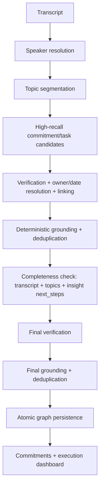

# Execution Intelligence v2

Parfait converts a meeting into an execution graph:

```text
Meeting -> Commitments -> Tasks -> Deliverables
```

## Pipeline



The extraction stage optimizes for recall. Verification removes decisions,
speculation, negated work, completed work, and ungrounded candidates. Unknown
owners and dates are represented as `null`; missing metadata never causes a
real commitment to be dropped.

## Modules

- `schemas.ts`: strict candidate/graph model contracts
- `prompts.ts`: candidate, verification, and completeness instructions
- `model.ts`: structured-output OpenAI adapter with latency/validation results
- `stages.ts`: isolated candidate, verification, and completeness stages
- `graph.ts`: grounding, link repair, and deterministic semantic deduplication
- `persistence.ts`: atomic graph replacement through a PostgreSQL function
- `pipeline.ts`: end-to-end orchestration and invariants
- `observability.ts`: stage and summary metrics
- `evaluation.ts`: offline matching and quality metrics

## Persistence

Migration `20260723010000_add_execution_commitments.sql` adds:

- `meeting_commitments` as a first-class parent entity
- optional `meeting_tasks.commitment_id`
- task owners, due-date text, evidence segment IDs, inferred flag, metadata
- `replace_meeting_execution_graph(...)`, which atomically replaces a meeting's
  commitments and tasks only after the graph passes all verification stages

Reprocessing no longer explicitly deletes tasks before extraction. Topic
deletion sets task/commitment `topic_id` to null, preserving the previous graph
until atomic replacement succeeds.

## Observability

Each run logs:

- candidate and verified commitment/task counts
- linked/unlinked and deduplicated task counts
- completeness additions
- grounding rejections
- OpenAI latency by stage
- validation/database failures
- fallback usage

Logs use the prefix `[execution-intelligence]`.

## Offline evaluation

Thirty synthetic fixtures cover explicit, implicit, indirect, question-based,
conditional, recurring, corrected, negated, completed, multi-turn, group, and
cross-topic work.

```bash
npm run eval:execution
npm run eval:execution -- path/to/predictions.json
```

The no-argument command validates the fixture/harness reference labels. A
predictions file keyed by fixture id scores real recorded model output and exits
non-zero when MVP thresholds regress.

## Operational note

The pipeline makes candidate, initial verification, completeness, and final
verification model calls. The analyze route therefore requires the existing
Vercel Pro 300-second function budget. A future optimization can combine stages
for short meetings or execute independent topic candidate calls concurrently.
