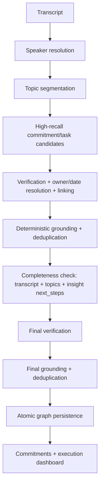

# Execution Intelligence v2

Parfait converts a meeting into an execution graph:

```text
Meeting -> Commitments -> Tasks -> Deliverables
```

## Pipeline



The extraction stage optimizes for recall. Verification removes decisions,
speculation, negated work, completed work, and ungrounded candidates. Unknown
owners and dates are represented as `null`; missing metadata never causes a
real commitment to be dropped.

## Modules

- `schemas.ts`: strict candidate/graph model contracts
- `prompts.ts`: candidate, verification, and completeness instructions
- `model.ts`: structured-output OpenAI adapter with latency/validation results
- `stages.ts`: isolated candidate, verification, and completeness stages
- `graph.ts`: grounding, link repair, and deterministic semantic deduplication
- `consolidation.ts`: commitment-first merge, restatement rejection, classification cleanup
- `persistence.ts`: atomic graph replacement through a PostgreSQL function
- `pipeline.ts`: end-to-end orchestration and invariants
- `durable-pipeline.ts`: reusable stage functions for the background worker
- `normalization.ts`: ownership restatement cleanup and quality rules
- `observability.ts`: stage and summary metrics
- `evaluation.ts`: offline matching and quality metrics
- `lib/meeting-analysis/`: enqueue, job state, topic preparation, and worker
- `app/api/internal/meeting-analysis/worker`: chained stage runner
- `lib/execution-display.ts`: commitment/task partitioning for UI and follow-ups

## Persistence

Migration `20260723010000_add_execution_commitments.sql` adds:

- `meeting_commitments` as a first-class parent entity
- optional `meeting_tasks.commitment_id`
- task owners, due-date text, evidence segment IDs, inferred flag, metadata
- `replace_meeting_execution_graph(...)`, which atomically replaces a meeting's
  commitments and tasks only after the graph passes all verification stages

Migration `20260724140000_add_background_analysis_jobs.sql` adds:

- `transcript_ready` meeting status after transcript import
- `meeting_analysis_jobs` with queued/running/completed/failed/stale state
- `claim_meeting_analysis_job(...)` which atomically claims a generation and
  inserts the queued job row

Reprocessing no longer explicitly deletes tasks before extraction. Topic
deletion sets task/commitment `topic_id` to null, preserving the previous graph
until atomic replacement succeeds.

## Background analysis

Transcript sync and analysis are independent:

1. Recall webhook / sync-status imports the transcript and sets
   `meetings.status = transcript_ready`.
2. `POST /api/meetings/[id]/analyze` claims a generation, enqueues a background
   worker job, and returns HTTP 202 immediately.
3. `POST /api/internal/meeting-analysis/worker` runs one durable stage per
   invocation (topic extraction → chunked candidates → batched verification →
   completeness → final verification → atomic persistence) and chains the next
   stage via `after()` so each hop gets a fresh function duration budget.
4. `GET /api/meetings/[id]/analysis-status` exposes job progress for the UI.

Stale-generation protection remains: only the latest claimed generation may
persist, and superseded jobs are marked `stale`.

Intermediate graph state is stored on `meeting_analysis_jobs.checkpoint`.

## Commitment-first consolidation

After final verification, `consolidation.ts` deterministically:

- merges near-duplicate commitments and tasks
- rejects child tasks that merely restate their parent commitment
- drops unsupported generic inferred ceremony steps
- preserves classification so only `committed` items drive the execution queue

Items may be classified as `committed`, `proposed`, `requirement`, or
`future_consideration`. Ideas/requirements stay visible but do not count toward
action-item totals, owner workload, or follow-up emails.

## Observability

Each run logs:

- candidate and verified commitment/task counts
- linked/unlinked and deduplicated task counts
- completeness additions
- grounding rejections
- OpenAI latency by stage
- validation/database failures
- fallback usage

Logs use the prefix `[execution-intelligence]`.

## Offline evaluation

Thirty synthetic fixtures cover explicit, implicit, indirect, question-based,
conditional, recurring, corrected, negated, completed, multi-turn, group, and
cross-topic work.

```bash
npm run eval:execution
npm run eval:execution -- path/to/predictions.json
```

The no-argument command validates the fixture/harness reference labels. A
predictions file keyed by fixture id scores real recorded model output and exits
non-zero when MVP thresholds regress.

## Operational note

Analysis runs as a chained background worker so long meetings are not bound to
a single HTTP function timeout. `POST /api/meetings/[id]/analyze` only enqueues
work and returns 202. Sync/webhook routes import transcripts and enqueue
analysis without waiting for model stages to finish. Each worker stage uses the
existing Pro `maxDuration` budget (300s).

## Temporary staging candidate diagnostics

With staging service-role credentials configured, compare candidate generation
for the first 20 segments, first 50 segments, and the full meeting:

```bash
npm run diagnose:execution-candidates -- <staging_meeting_id>
```

The read-only command refuses to run when staging and production URLs match. It
prints model/input sizing, request timestamps, elapsed time, and success status.
It does not persist candidates or modify the meeting.
